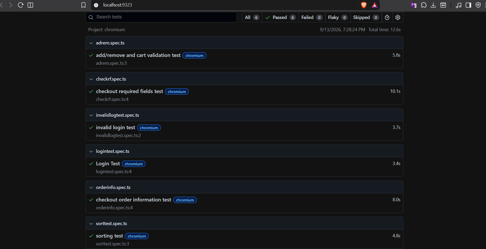

# SauceDemo Playwright Automation Tests

## Overview

This project contains automated UI tests for the SauceDemo e-commerce website using Playwright and TypeScript.

The purpose of the project is to test important user journeys including login, invalid login, product sorting, cart operations, and checkout.

## Tools Used

* Playwright
* TypeScript
* Node.js
* npm
* ChatGPT (For documentation)

## Website Under Test

SauceDemo

https://www.saucedemo.com/

## Test Coverage

### 1. Valid Login Test

**File:** `logintest.spec.ts`

Verifies that a user can successfully log in using valid credentials.

**Steps covered:**

* Open SauceDemo
* Log in using valid credentials
* Verify that "Swag Labs" is visible

### 2. Invalid Login Test

**File:** `invalidlogtest.spec.ts`

Verifies that the application displays an error when invalid credentials are used.

**Steps covered:**

* Open SauceDemo
* Enter a valid username
* Enter an invalid password
* Click Login
* Verify that the error message can be dismissed

### 3. Product Sorting Test

**File:** `sorttest.spec.ts`

Verifies that products can be sorted by price from lowest to highest.

**Steps covered:**

* Log in
* Select "Price (low to high)"
* Retrieve the displayed product prices
* Convert the prices from text to numbers
* Compare each price with the following price
* Verify that the prices are in ascending order

### 4. Add, Remove and Cart Validation Test

**File:** `adrem.spec.ts`

Verifies that products can be added and removed from the cart and that the cart count is updated correctly.

**Steps covered:**

* Log in
* Add products to the cart
* Remove a product
* Verify that the shopping cart badge displays `2`

### 5. Checkout Required Fields Test

**File:** `checkrf.spec.ts`

Verifies that the required checkout fields cannot be left empty.

The following fields are tested:

* First Name
* Last Name
* Postal Code

**Steps covered:**

* Log in
* Add a product
* Open the cart
* Go to checkout
* Leave First Name empty and verify the required-field error
* Fill First Name and leave Last Name empty
* Verify the required-field error
* Fill Last Name and leave Postal Code empty
* Verify the required-field error

All three validation checks are performed during the same checkout session.

### 6. Checkout Order Information Test

**File:** `orderinfo.spec.ts`

Verifies that a user can complete an order using valid checkout information.

**Steps covered:**

* Log in
* Add a product
* Open the cart
* Go to checkout
* Enter First Name, Last Name and Postal Code
* Continue to the Checkout Overview
* Verify that the Checkout Overview page is displayed
* Verify Payment Information is displayed
* Verify Shipping Information is displayed
* Verify Price Total is displayed
* Finish the order
* Verify the "Thank you for your order!" confirmation

## Reusable Login Helper

The project uses a reusable login function located inside the `helpers` folder.

**File:** `tests/helpers/login.ts`

The login helper handles:

* Opening the SauceDemo website
* Entering the username
* Entering the password
* Clicking the Login button

Tests that require a successful login call the reusable function:

```ts
await login(page);
```

This avoids repeating the same login steps in multiple test files.

The invalid login test does not use the helper because it requires invalid credentials.

## Project Structure

```text
tests/
│
├── helpers/
│   └── login.ts
│
├── adrem.spec.ts
├── checkrf.spec.ts
├── invalidlogtest.spec.ts
├── logintest.spec.ts
├── orderinfo.spec.ts
└── sorttest.spec.ts


```

## Test Data

The tests use the SauceDemo standard test account:

* Username: `standard_user`
* Password: `secret_sauce`

The checkout tests use test customer information:

* First Name: `Fares`
* Last Name: `Alahmad`
* Postal Code: `12345`

No real payment information is used.

## Installation

Install the project dependencies:

```bash
npm install
```

Install Playwright browsers if required:

```bash
npx playwright install
```

## Running the Tests

### Run All Tests

```bash
npx playwright test
```

### Run Tests Using Chromium

```bash
npx playwright test --project chromium
```

### Run a Specific Test

For example:

```bash
npx playwright test sorttest.spec.ts
```

### Open the Playwright HTML Report

After running the tests:

```bash
npx playwright show-report
```

## Test Execution

All automated tests were executed successfully.

The test suite was run using Playwright, and all implemented tests passed successfully.

A screenshot of the successful test execution is included below as evidence of the test results.



## Test Design Approach

The tests were designed using the following principles:

* Clear and readable test names
* Playwright locators
* Assertions to verify expected results
* Reusable login functionality
* Independent test execution
* No unnecessary hard waits
* Simple and maintainable test structure

Each test performs the actions required for its own scenario and does not depend on another test being executed first.

## Assumptions and Limitations

* Testing was performed against the SauceDemo test environment.
* The standard SauceDemo test account is used.
* The test suite focuses on functional UI testing.
* Performance, load, security and accessibility testing are outside the scope of this project.
* Static test data is used because SauceDemo is a controlled test environment.
* No real customer payment information is used.
* Tests are primarily executed using Chromium.

## Conclusion

This automated test suite covers the main SauceDemo user journeys, including authentication, invalid authentication, product sorting, cart management, checkout validation and successful checkout.

The project demonstrates the use of Playwright with TypeScript, reusable functions, locators, assertions and independent automated tests.
